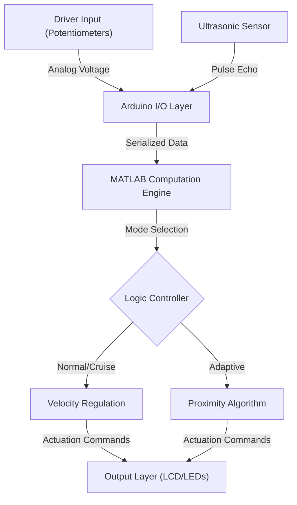

# Technical Specification: Adaptive Cruise Control (ACC)

## Architectural Overview
The **Adaptive Cruise Control (ACC)** system is implemented as a real-time embedded control application leveraging the **MATLAB Support Package for Arduino**. The system utilizes a closed-loop control model to manage vehicle velocity through continuous sensory feedback from an ultrasonic transducer and simulated driver inputs.

### Architectural Flow

## 1. Program Structure
The primary control logic is defined in `Adaptive Cruise Control.m`. The architecture follows a synchronous "Super-Loop" pattern, ensuring high-fidelity sampling of hardware peripherals and deterministic response times.

### Core Components:
- **Hardware Abstraction Layer (`arduino()`, `ultrasonic()`, `addon()`)**: Establishes the communication bridge with the Arduino board and configures pin-level semantics for sensors and indicators.
- **Sensory Data Acquisition (`readVoltage()`, `readDistance()`)**: Fetches real-time telemetry from analog and digital pins to populate the system's state variables.
- **Computation & Actuation Layer**: Processes sensory data through conditional branch logic to determine pulse-width modulation equivalents (simulated via speed variables) and drive physical indicators.

## 2. State Machine Logic
The system operates through three distinct operational modes determined by the input voltage detected on the mode-selection pins.

| State | Trigger | Control Logic |
|-------|---------|------------------|
| **Normal Mode (0)** | Manual Reset / Cancel | Open-loop regulation; manual acceleration/braking with simulated drag. |
| **Cruise Mode (1)** | Set Speed Active | Automated maintenance of fixed target velocity based on user input. |
| **Adaptive Mode (2)**| ACC Button Active | Proximity-aware regulation; dynamic deceleration based on leading vehicle distance. |

## 3. Proximity Control Algorithm
The Adaptive Cruise Control mode employs a predictive distance algorithm to maintain a safety buffer between the vehicle and environmental obstacles.

### The ACC Algorithm:
The system continuously monitors the `distance` variable (in meters) provided by the HC-SR04 sensor:
1. **Hazard Detection**: If `distance < 0.3m`, the system executes an automated deceleration sequence, decrementing the velocity until the safety threshold is restored.
2. **Path Clear**: If `distance >= 0.3m`, the system initiates a velocity restoration phase, incrementing speed until it reaches the user-defined `constant` cruise velocity.
3. **Boundary Guarding**: Logical constraints ensure the velocity never exceeds the cached target speed or drops below zero (standstill).

## 4. Input & User Interface
The program employs a hybrid input model interfacing physical hardware with real-time software feedback:
- **Analog Control Subsystem**: Utilizes potentiometers to simulate acceleration, braking, and mode switching through 0-5V voltage levels.
- **LCD Feedback Loop**: Employs an I2C/Parallel LCD peripheral to provide high-fidelity status updates, current velocity telemetry, and active mode identifiers to the driver.

## 5. Data Structures
- **State Variables**: Scalar doubles representing `speed`, `distance`, and `mode` ensuring precision in telemetry.
- **Input Buffers**: Volatile memory structures for voltage readings ensure the system remains responsive to rapid driver intervention.

---
*Technical Specification | MEng Computer Engineering Project | Version 1.0*
